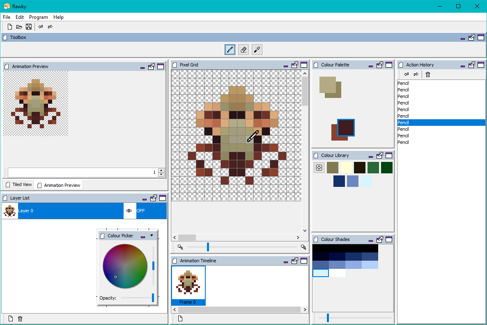

<h1 align="center">
    Rawky
     
    

        
        
    

</h1>

<h4 align="center">A pixel art editor</h4>

    
    

    
    
    
    
    

    
    
    
    

## Table of Contents
- [Key Features](#key-features)
- [About](#about)
    - [Built With](#built-with)
- [Screenshots](#screenshots)
- [Download](#download)
- [Credits](#credits)

## Key Features
- Dock-based layout - lay the program out to suit your style
- Multiple themes (light and dark)
- Colour palette - organize your colours how you want
- Animation preview
- Timeline with onion skinning
- Quickly assign different tools to each mouse button

## About
Rawky aims to be an easy, fast and smart tool for any aspiring artist, though it is more focused towards pixel art.

Rawky features layers, that can be previewed to the left, and both be hidden and locked/unlocked to the right.
It also has frames, which can be previewed above their name.

### Built With
- [Kotlin](https://kotlinlang.org/)
- [Swing](https://en.wikipedia.org/wiki/Swing_(Java\\))

## Screenshots
||
|---|
||
||

## Download
> Note: To use on *any OS, use the JAR (but you'll need Java installed)

| | Version |
|---|---|
| **Latest** |  |
| |  |
| |  |
| |  |
| |  |
| |  |
| |  |
| |  |
| |  |
> This table is manually updated and can lag behind, check the releases tab to see if there is a newer version available

## Building From Source
To build the program from source, you will need:
- A JDK for Java 9 or above
- A terminal

Then, after navigating to the source directory with your terminal, run:
- `gradle generateGrammarSource`
Then, if you would like a JAR, run `gradle shadowJar`, and if you would like an EXE, run `gradle createExe`.

## Suggestions
I'm always looking to improve Rawky and the experience of using it, so if you have an idea, feel free to [open an issue](https://github.com/DeflatedPickle/Rawky/issues/new), detailing your idea and we can talk about it.

## Credits
- [Travis](https://travis-ci.org/)
- [Gradle](https://gradle.org/)
- [Shadow](https://github.com/johnrengelman/shadow)
- [Launch4j](http://launch4j.sourceforge.net/)
* [DockingFrames](https://github.com/Benoker/DockingFrames)
* [ColorPicker](https://mvnrepository.com/artifact/org.drjekyll/colorpicker)
* [SwingX](https://mvnrepository.com/artifact/org.swinglabs/swingx)
* [WrapLayout](https://github.com/DeflatedPickle/WrapLayout)
* [Dracula](https://github.com/bulenkov/Darcula)
* [Radiance](https://github.com/kirill-grouchnikov/radiance)
* [WebLaF](https://github.com/mgarin/weblaf)
* [GSON](https://github.com/google/gson)
* [ICAFE](https://github.com/dragon66/icafe)
